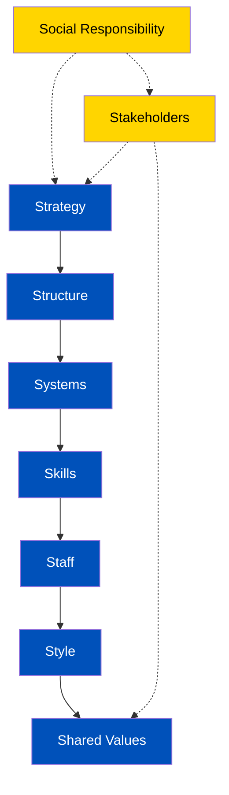
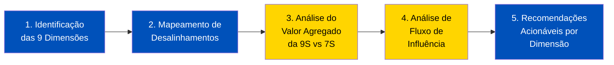

# 🏢 IKEA India: Organizational Alignment Case Study

<div align="center">


**Uma análise profunda dos desafios de alinhamento organizacional da IKEA em sua entrada no mercado indiano**

[📊 Ver Análise](#análise-completa) • [🎯 Principais Insights](#principais-insights) • [💡 Recomendações](#recomendações-estratégicas)

</div>

---

## 📖 Sobre o Projeto

Este repositório contém uma análise estruturada e abrangente do caso **IKEA India**, utilizando a **Matriz 9S da Deloitte-Marzo** como framework principal. O estudo examina os desafios organizacionais enfrentados pela gigante sueca do varejo de móveis em sua expansão para um dos mercados mais complexos do mundo.

### 🎯 Objetivo

Demonstrar capacidade analítica, pensamento estruturado e abordagem prática para resolução de problemas organizacionais complexos em contextos de expansão internacional.

---

## 📚 Contexto do Caso

<table>
<tr>
<td width="50%">

### 📅 Linha do Tempo

- **Agosto 2018**: Abertura da primeira loja em Hyderabad
- **Q1 2019**: Pico de performance (NPS: 74)
- **2019-2020**: Emergência de sinais de tensão organizacional
- **Late 2020**: Reconhecimento interno de falhas de alinhamento
- **Q3 2021**: Deterioração significativa (NPS: 59)

</td>
<td width="50%">

### 💰 Investimento

- **€1.4 bilhões** comprometidos
- **40.000+** visitantes no primeiro dia
- **34%** queda no fluxo após Q1 2019
- **24.7%** rotatividade gerência média
- **+12 meses** atraso em novas lojas

</td>
</tr>
</table>

---

## 🔍 Framework Utilizado

### A Matriz 9S da Deloitte-Marzo

A análise utiliza uma evolução do clássico modelo 7-S da McKinsey, expandido por Marzo para capturar dimensões críticas de stakeholders e responsabilidade social.



<details>
<summary><b>🔎 Por que 9S e não 7S?</b></summary>

<br>

As dimensões **Stakeholders** e **Social Responsibility** revelam camadas de desalinhamento invisíveis ao modelo tradicional:

- **Stakeholders**: Captura tensões entre consumidores, investidores, fornecedores e funcionários
- **Social Responsibility**: Identifica falhas em integrar compliance regulatório com estratégia de entrada

Essas adições são críticas para mercados emergentes onde responsabilidade social e gestão de stakeholders complexos são determinantes de sucesso.

</details>

---

## 📊 Principais Insights

### 🚨 O Efeito Dominó do Desalinhamento

```
┌─────────────┐      ┌─────────────┐      ┌─────────────┐      ┌─────────────┐
│  Strategy   │ ───▶│  Structure  │ ───▶ │   Systems   │ ───▶│   Staff     │
│             │      │             │      │             │      │             │
│ Produto EU  │      │ Duplo       │      │ Plataformas │      │ Rotatividade│
│ p/ mercado  │      │ reporte     │      │ incompatí-  │      │ 24.7%       │
│ indiano     │      │ ambíguo     │      │ veis        │      │             │
└─────────────┘      └─────────────┘      └─────────────┘      └─────────────┘
```

### 💡 Descobertas-Chave por Dimensão

<table>
<tr>
<th width="20%">Dimensão</th>
<th width="40%">Problema Principal</th>
<th width="40%">Impacto Mensurável</th>
</tr>

<tr>
<td><b>📋 Strategy</b></td>
<td>Produto europeu incompatível com apartamentos indianos</td>
<td>60-70% abaixo da previsão em categorias core</td>
</tr>

<tr>
<td><b>🏗️ Structure</b></td>
<td>Duplo reporte criando ambiguidade decisória</td>
<td>Apenas 39% entendem cadeia de decisão</td>
</tr>

<tr>
<td><b>⚙️ Systems</b></td>
<td>Plataformas de estoque incompatíveis</td>
<td>Conversão online <1.5%</td>
</tr>

<tr>
<td><b>🎓 Skills</b></td>
<td>Falta de competências para mercado emergente</td>
<td>Taxa de rejeição QA 8.2% vs 1.4% global</td>
</tr>

<tr>
<td><b>👥 Staff</b></td>
<td>Choque cultural entre expatriados e locais</td>
<td>Apenas 32% se sentem ouvidos pela matriz</td>
</tr>

<tr>
<td><b>💼 Style</b></td>
<td>Comunicação unidirecional e eurocêntrica</td>
<td>41% gerentes sobrecarregados sem feedback</td>
</tr>

<tr>
<td><b>❤️ Shared Values</b></td>
<td>Valores nórdicos abstratos para contexto local</td>
<td>India Market Labs pausado após 6 meses</td>
</tr>

<tr>
<td><b>🤝 Stakeholders</b></td>
<td>Falha em balancear expectativas múltiplas</td>
<td>NPS caiu de 74 para 59 (-20%)</td>
</tr>

<tr>
<td><b>🌱 Social Responsibility</b></td>
<td>Sourcing local tratado como compliance, não estratégia</td>
<td>+12 meses de atraso em Mumbai e Bengaluru</td>
</tr>

</table>

---

## 🎯 Recomendações Estratégicas

### 🚀 Roadmap de Transformação

<details open>
<summary><b>📅 Curto Prazo (0-6 meses): Estabilização</b></summary>

<br>

| Ação | Dimensão Impactada | Métrica de Sucesso |
|------|-------------------|-------------------|
| Criar India Product Council com autonomia decisória | Strategy, Structure | Redesign de 20 SKUs core |
| Eliminar duplo reporte | Structure, Style | Clareza decisória >80% |
| Reduzir volume de relatórios em 40% | Style, Staff | Engagement score +15pts |

</details>

<details>
<summary><b>📅 Médio Prazo (6-18 meses): Capacitação</b></summary>

<br>

| Ação | Dimensão Impactada | Métrica de Sucesso |
|------|-------------------|-------------------|
| Integração completa de plataformas de estoque | Systems | Conversão online >3% |
| IKEA India Academy com conteúdo localizado | Skills, Staff | Rotatividade <12% |
| Supplier Development Program (€10M) | Social Responsibility | QA rejection <3% |

</details>

<details>
<summary><b>📅 Longo Prazo (18-36 meses): Escalabilidade</b></summary>

<br>

| Ação | Dimensão Impactada | Métrica de Sucesso |
|------|-------------------|-------------------|
| Hub de Inovação Regional em Bengaluru | Strategy, Skills | 30% sortimento local |
| Modelo omnichannel integrado | Systems, Stakeholders | NPS >70 |
| Embedding de valores contextualizados | Shared Values, Staff | Cultura score >75% |

</details>

---

## 📁 Estrutura do Repositório

```
📦 ikea-india-case-study
├── 📄 README.md                          # Este arquivo
├── 📂 analysis/
│   ├── 📄 full-analysis-pt.md            # Análise completa em português
│   ├── 📄 9s-framework-breakdown.md      # Detalhamento por dimensão
│   └── 📄 flow-of-influence.md           # Análise de fluxo de influência
├── 📂 data/
│   ├── 📄 case-study-original.pdf        # Caso original (EN)
│   └── 📄 case-study-translated-pt.pdf   # Caso traduzido (PT-BR)
├── 📂 visuals/
│   ├── 🖼️ 9s-framework-diagram.png
│   ├── 🖼️ misalignment-cascade.png
│   └── 🖼️ recommendations-roadmap.png
└── 📂 references/
    ├── 📄 9s-matrix-methodology.md
    └── 📄 additional-readings.md
```

---

## 🧠 Metodologia de Análise

### Processo de 5 Etapas



---

## 🔑 Key Takeaways

> ### 💭 "A IKEA subestimou a complexidade de alinhamento necessária para adaptação de mercado sustentável"
> 
> *— IKEA Internal Strategy Review, Late 2020*

### 3 Lições Principais

1. **🌍 Expansão Global ≠ Replicação de Modelo**
   - Sucesso em mercados desenvolvidos não garante sucesso em mercados emergentes
   - Product-market fit requer adaptação genuína, não apenas tradução

2. **🏗️ Estrutura Determina Comportamento**
   - Duplo reporte sem clareza gera paralisia, não coordenação
   - Autonomia local deve ser real, não cosmética

3. **🔄 Desalinhamento é Sistêmico e Cascata**
   - Falhas estratégicas se amplificam através de todas as dimensões
   - Intervenções pontuais são insuficientes; transformação requer abordagem holística

---

## 📈 Resultados Esperados

### Se as recomendações forem implementadas:

<table>
<tr>
<td width="33%" align="center">

### 🎯 6 Meses
**Estabilização**

NPS: **59 → 65**  
Rotatividade: **24.7% → 18%**  
Clareza decisória: **39% → 80%**

</td>
<td width="33%" align="center">

### 🚀 18 Meses
**Aceleração**

NPS: **65 → 72**  
Conversão online: **1.5% → 3.5%**  
QA rejection: **8.2% → 3.0%**

</td>
<td width="33%" align="center">

### 🏆 36 Meses
**Liderança**

NPS: **72 → 78**  
Sortimento local: **30%**  
ROI positivo

</td>
</tr>
</table>

---

## 🛠️ Ferramentas Utilizadas


---

## 👤 Sobre o Autor

Análise desenvolvida como parte de processo seletivo, demonstrando:

- ✅ Pensamento analítico estruturado
- ✅ Capacidade de síntese e identificação de padrões
- ✅ Abordagem prática para resolução de problemas complexos
- ✅ Comunicação clara de insights acionáveis

---

## 📄 Licença

Este projeto é um estudo de caso acadêmico para fins de avaliação profissional.

---

<!-- Início da seção "Contato" -->
<h2>🌐 Contate-me: </h2>
<div>
  <p>Developed by <b>Fábio Nogueira</b></p>
</div>
<p>
<a href="https://www.linkedin.com/in/faanogueira/" target="_blank"></a>
<a href="https://github.com/faanogueira" target="_blank"></a>
<a href="https://api.whatsapp.com/send?phone=5571983937557" target="_blank"></a>
<a href="mailto:faanogueira@gmail.com"></a> 
</p>
<!-- Fim da seção "Contato" -->

**⭐ Se este trabalho foi útil, considere dar uma estrela no repositório!**

</div>
