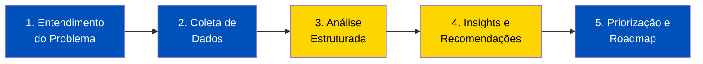

# 🎯 Strategic Analysis Portfolio

<div align="center">


**Demonstrando capacidade analítica através de casos reais de negócio**

[📊 Ver Projetos](#-projetos) • [💼 Sobre](#-sobre) • [📬 Contato](#-contato)

</div>

---

## 🚀 Sobre Este Portfólio

Este repositório reúne análises estratégicas profundas de casos de negócio reais, demonstrando:

- **🧠 Pensamento Analítico Estruturado** - Uso de frameworks reconhecidos
- **📈 Data-Driven Decision Making** - Evidências quantitativas e qualitativas  
- **🎯 Problem-Solving Prático** - Recomendações acionáveis e priorizadas
- **📝 Comunicação Clara** - Documentação profissional e acessível

Cada projeto explora desafios organizacionais complexos e propõe soluções fundamentadas em metodologias consagradas de consultoria estratégica.

---

## 📂 Projetos

### 1️⃣ [IKEA India: Desafios de Alinhamento Organizacional](./01-ikea-india-organizational-alignment/)

<table>
<tr>
<td width="60%">

**Framework:** Matriz 9S da Deloitte-Marzo  
**Contexto:** Expansão internacional em mercado emergente  
**Desafio:** Falhas de alinhamento entre estratégia global e execução local

**Principais Insights:**
- 🔴 NPS caiu 20% em 2 anos (74 → 59)
- 🔴 Rotatividade de gerência média: 24,7% em 18 meses
- 🔴 Atrasos de +12 meses em novas lojas
- ✅ Roadmap de transformação em 3 fases desenvolvido

**Skills Demonstradas:**
- Análise sistêmica de organizações complexas
- Mapeamento de interdependências e fluxos de influência
- Priorização estratégica (impacto vs viabilidade)
- Desenvolvimento de roadmap de transformação

</td>
<td width="40%">

```
📊 Métricas-Chave
├─ 9 dimensões analisadas
├─ 27 gaps identificados
├─ 12 ações priorizadas
└─ 3 fases de implementação

🎯 Frameworks Usados
├─ Matriz 9S (Deloitte-Marzo)
├─ Gap Analysis
├─ Root Cause Analysis
└─ Stakeholder Mapping
```

**Status:** ✅ Completo  
**Tempo:** 4 semanas  
**Páginas:** 45+

[📖 Ver Análise Completa →](./01-ikea-india-organizational-alignment/README.md)

</td>
</tr>
</table>

---

### 2️⃣ [Em Breve: Análise de Transformação Digital](#)

<table>
<tr>
<td width="60%">

**Framework:** Digital Maturity Model + McKinsey 7-S  
**Contexto:** Empresa tradicional em processo de digitalização  
**Desafio:** Resistência cultural e gaps de competências digitais

**Foco da Análise:**
- Avaliação de maturidade digital
- Identificação de barreiras culturais
- Roadmap de capacitação
- Quick wins vs transformações estruturais

</td>
<td width="40%">

**Status:** 🔄 Em desenvolvimento  
**Previsão:** Dezembro 2024

</td>
</tr>
</table>

---

### 3️⃣ [Em Breve: M&A Cultural Integration](#)

<table>
<tr>
<td width="60%">

**Framework:** Cultural Due Diligence + Integration Playbook  
**Contexto:** Fusão de empresas com culturas distintas  
**Desafio:** Retenção de talentos e integração efetiva

**Foco da Análise:**
- Mapeamento de valores culturais
- Identificação de pontos de conflito
- Estratégia de integração cultural
- Métricas de sucesso (retenção, engagement)

</td>
<td width="40%">

**Status:** 📋 Planejado  
**Previsão:** Janeiro 2025

</td>
</tr>
</table>

---

## 🛠️ Metodologias e Frameworks

### Frameworks de Análise Organizacional

<table>
<tr>
<td align="center" width="25%">

**Matriz 9S**  
(Deloitte-Marzo)

Análise holística de alinhamento organizacional

✅ Usado em Projeto #1

</td>
<td align="center" width="25%">

**7-S Framework**  
(McKinsey)

Modelo clássico de diagnóstico organizacional

🔄 Planejado

</td>
<td align="center" width="25%">

**PESTEL Analysis**

Análise de contexto macro-ambiental

🔄 Planejado

</td>
<td align="center" width="25%">

**Porter's Five Forces**

Análise competitiva de indústria

🔄 Planejado

</td>
</tr>
</table>

### Metodologias de Análise

- ✅ **Gap Analysis** - Identificação de desalinhamentos
- ✅ **Root Cause Analysis** - 5 Porquês e Fishbone
- ✅ **Stakeholder Mapping** - Análise de partes interessadas
- ✅ **Impact vs Feasibility Matrix** - Priorização de ações
- ✅ **Flow Analysis** - Mapeamento de interdependências
- 🔄 **Business Model Canvas** - Modelagem de negócios
- 🔄 **Value Chain Analysis** - Análise da cadeia de valor

---

## 💼 Sobre

### Competências Demonstradas

<table>
<tr>
<td width="50%">

#### 🎯 Análise Estratégica
- Diagnóstico organizacional profundo
- Identificação de causas raiz vs sintomas
- Pensamento sistêmico (interdependências)
- Uso de frameworks consagrados

#### 📊 Análise de Dados
- Interpretação de métricas quantitativas
- Análise qualitativa (entrevistas, surveys)
- Data storytelling
- Visualização de insights

</td>
<td width="50%">

#### 💡 Problem-Solving
- Estruturação de problemas complexos
- Priorização baseada em impacto e viabilidade
- Desenvolvimento de roadmaps acionáveis
- Gestão de trade-offs

#### 📝 Comunicação
- Documentação profissional
- Síntese executiva de análises complexas
- Storytelling com dados
- Apresentação estruturada de insights

</td>
</tr>
</table>

### Abordagem de Trabalho



**Princípios:**
- 📌 **Foco em causas raiz**, não apenas sintomas
- 📊 **Evidências quantitativas** sempre que possível
- 🎯 **Recomendações acionáveis**, não apenas diagnóstico
- 🔄 **Pensamento sistêmico** sobre interdependências
- 💼 **Viabilidade prática** vs soluções teóricas

---

## 📚 Background Acadêmico e Profissional

### Formação
- 🎓 **[Sua Formação]** - [Universidade]
- 📜 **Certificações:** [Suas certificações relevantes]

### Áreas de Interesse
- 🌍 Expansão Internacional e Mercados Emergentes
- 🏢 Transformação Organizacional
- 📈 Estratégia Corporativa
- 🤝 Change Management
- 💡 Inovação em Modelos de Negócio

### Inspirações
> *"Strategy is about making choices, trade-offs; it's about deliberately choosing to be different."*  
> — Michael Porter

> *"Culture eats strategy for breakfast."*  
> — Peter Drucker

---

## 🔧 Ferramentas e Tecnologias

<div align="center">


</div>

**Análise:**
- Frameworks de consultoria (9S, 7-S, Porter, PESTEL)
- Excel / Google Sheets (modelagem e análise)
- PowerBI / Tableau (visualização)
- Python (análise de dados, quando aplicável)

**Documentação:**
- Markdown (documentação técnica)
- Mermaid (diagramas)
- Canva / Figma (infográficos)
- LaTeX (documentos acadêmicos)

**Gestão:**
- Git / GitHub (versionamento)
- Notion / Obsidian (gestão de conhecimento)
- Miro / Excalidraw (workshops visuais)

---

## 📈 Estatísticas do Portfólio

<div align="center">

| Métrica | Valor |
|---------|-------|
| 📊 Projetos Completos | 1 |
| 📝 Páginas de Análise | 45+ |
| 🎯 Frameworks Aplicados | 5 |
| ⏱️ Horas de Análise | 40+ |
| 💡 Insights Documentados | 50+ |
| 🚀 Recomendações Desenvolvidas | 12 |

</div>

---

## 🎯 Próximos Passos

### Em Desenvolvimento
- [ ] Projeto #2: Transformação Digital (60% completo)
- [ ] Adicionar visualizações interativas (Plotly)
- [ ] Criar templates reutilizáveis de análise

### Planejado
- [ ] Projeto #3: M&A Cultural Integration
- [ ] Caso de competitividade em e-commerce
- [ ] Análise de sustentabilidade corporativa
- [ ] Workshop: "Como Estruturar Case Studies"

---

## 📄 Licença

Este portfólio é mantido para fins educacionais e de demonstração de capacidades analíticas. Os casos estudados combinam informações públicas com elementos simulados para permitir análise profunda.

**Casos baseados em empresas reais** são usados estritamente para fins educacionais sob doutrina de fair use.

---

<!-- Início da seção "Contato" -->
<h2>🌐 Contate-me: </h2>
<div>
  <p>Developed by <b>Fábio Nogueira</b></p>
</div>
<p>
<a href="https://www.linkedin.com/in/faanogueira/" target="_blank"></a>
<a href="https://github.com/faanogueira" target="_blank"></a>
<a href="https://api.whatsapp.com/send?phone=5571983937557" target="_blank"></a>
<a href="mailto:faanogueira@gmail.com"></a> 
</p>
<!-- Fim da seção "Contato" -->

**⭐ Se este trabalho foi útil, considere dar uma estrela no repositório!**

</div>


⭐ Se este trabalho foi útil ou inspirador, considere dar uma estrela no repositório!

</div>
